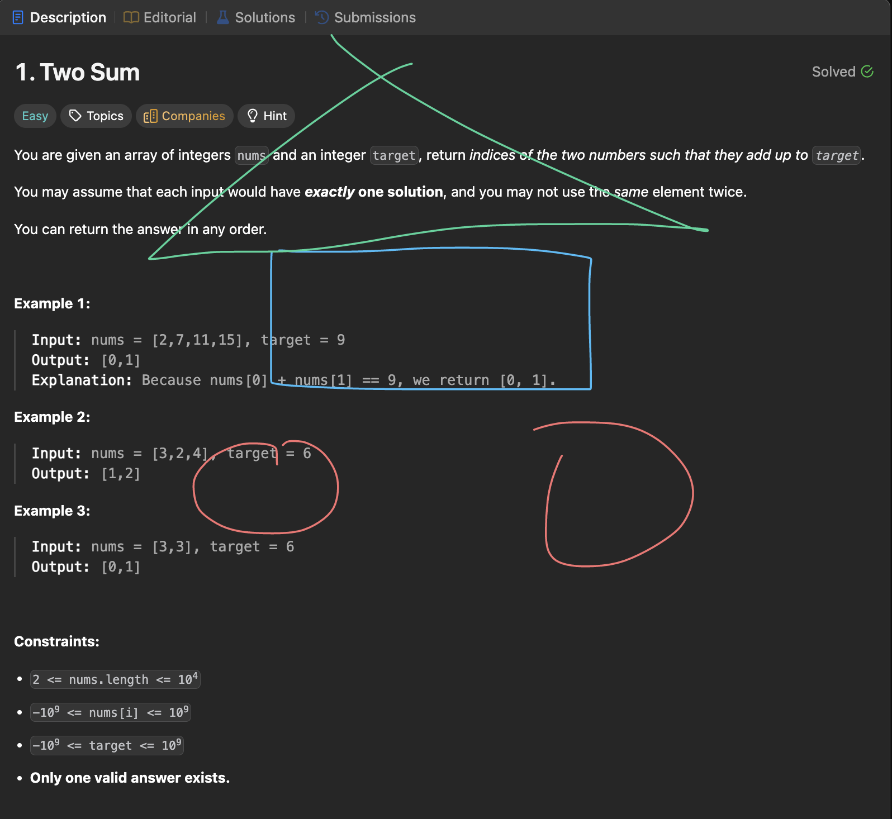
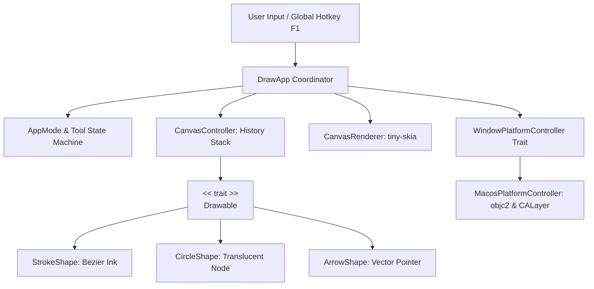

# 🖋️ draw-rs: High-Performance macOS Transparent Screen Doodle Overlay

<div align="center">

<p>
  <b>English</b> | <a href="./README.zh-TW.md">繁體中文</a>
</p>

[](https://www.rust-lang.org/)
[](https://apple.com/)
[](https://en.wikipedia.org/wiki/SOLID)
[](LICENSE)

**A lightweight, blazing-fast, transparent screen doodle overlay for macOS.**  
Tailored specifically for **LeetCode problem solving**, **system design interviews**, **whiteboard live coding**, and **data structure visual explanations**!

<br />

[Demo](#-demo-preview) •
[Features](#-core-features) •
[Keybindings](#-keyboard-shortcuts--controls) •
[SOLID Architecture](#-solid-software-architecture) •
[Quick Start](#-quick-start) •
[macOS Permissions](#-macos-permissions--transparency-guide) •
[License](#-license)

</div>

---

## 📸 Demo Preview

<div align="center">
  
  <p><em>Real-time transparent annotation over algorithmic problem solving & code editors</em></p>
</div>

---

## 💡 Why draw-rs?

When solving algorithmic problems on LeetCode, Codeforces, or during technical whiteboard interviews, switching between your browser, IDE, and external drawing tools (like Excalidraw or physical paper) breaks your train of thought.

`draw-rs` suspends a **100% natively transparent vector canvas** directly on top of your macOS desktop:
- 🌲 **Annotate Trees directly over problem descriptions**: Sketch Binary Search Trees, Tries, and AVL trees right on the webpage.
- 🔀 **Mark Two Pointers & Sliding Windows**: Clearly visualize indices (`left`, `right`) without context switching.
- 🔗 **Diagram Linked Lists & Directed Graphs**: Draw nodes and directional arrows (`curr -> next`) in real-time.
- ⚡ **Instant Click-Through Toggle (<kbd>F1</kbd>)**: Finished sketching your pointers? Press <kbd>F1</kbd> to make mouse clicks pass straight through to VS Code or your browser to type code, while keeping your doodles suspended for visual reference!

---

## 🌟 Core Features

| Feature | Technical Implementation & Highlights |
| :--- | :--- |
| **Native Zero-Alpha Transparency** | Built on macOS `NSWindow` & `CALayer` composited via Quartz. Background has Alpha = 0 with zero black artifacts or stuttering. |
| **Global Click-Through Toggle** | Powered by modern type-safe `objc2-app-kit` calling `setIgnoresMouseEvents:`. A background listener captures <kbd>F1</kbd> globally even when unfocused. |
| **Interactive Floating Menu HUD** | Translucent HUD with clickable tool buttons, color swatches, quick actions (Undo/Clear/Pass-thru), and drag-to-reposition support across all modes. |
| **Draggable HUD in Click-Through Mode** | Real-time coordinate hit-testing dynamically re-enables clicking and dragging on the HUD card even in click-through mode without interrupting background app usage. |
| **Algorithm Tools & Smart Eraser** | Smooth Pen (<kbd>P</kbd>), Translucent Nodes (<kbd>Circle</kbd>), Directional Pointers (<kbd>Arrow</kbd>), and an interactive Vector Eraser (<kbd>E</kbd>) with full undo support. |
| **Curated High-Contrast Palette** | High-visibility algorithm colors (Cyan, Emerald, Coral, Amber, Violet) engineered for both light and dark editor themes. |
| **Ultra-Lightweight & Performant** | Pure-CPU 2D vector rasterization via `tiny-skia`. Minimal memory footprint with a standalone binary of only ~1.4 MB. |

---

## ⌨️ Keyboard Shortcuts & Controls

```
┌─────────────────────────────────────────────────────────────────────────────────┐
│ ● DRAWING (3 shapes)               [Pass-Thru F1]                     ::: Drag  │
│ ─────────────────────────────────────────────────────────────────────────────── │
│ TOOLS: [Pen P] [Circle] [Arrow] [Eraser E]        [Undo Z]  [Clear C]           │
│ ─────────────────────────────────────────────────────────────────────────────── │
│ COLOR: (●) (●) (●) (●) (●)   [1-5]                                   [EN/中 L]  │
└─────────────────────────────────────────────────────────────────────────────────┘
```

| Key / Mouse | Action | Description |
| :---: | :--- | :--- |
| **Click Menu on HUD** | **Select Tool / Color / Action / Language** | Click any tool, color swatch, Undo, Clear, Pass-Thru, or Language toggle button directly on the floating HUD |
| **Drag HUD** | **Reposition HUD Card** | Click and drag anywhere on the HUD header or background to move it (active in **both** Drawing and Pass-Thru modes!) |
| <kbd>F1</kbd> | **Toggle Mode (Global)** | Switch between **Drawing Mode** and **Click-Through Mode** (works globally even when unfocused) |
| <kbd>F2</kbd> | **Cycle Tool** | Cycle: `Pen` ➔ `Circle (Tree/Graph Node)` ➔ `Arrow (Pointer/Edge)` ➔ `Eraser` |
| <kbd>E</kbd> | **Eraser Tool** | Switch directly to **Eraser** to erase strokes and shapes with an interactive circular cursor |
| <kbd>P</kbd> | **Pen Tool** | Switch directly back to **Pen** |
| <kbd>1</kbd> ~ <kbd>5</kbd> | **Switch Palette Color** | Clean circular swatches: Cyan, Emerald, Coral, Amber, Violet |
| <kbd>L</kbd> | **Toggle Language** | Switch interface language between **English** and **Traditional Chinese (繁體中文)** |
| <kbd>Z</kbd> | **Undo** | Reversibly undo drawn shapes or restore erased strokes/shapes |
| <kbd>C</kbd> | **Clear** | Clear all doodles and annotations on screen |
| <kbd>Esc</kbd> | **Exit** | Close and gracefully quit the application |

---

## 🏗️ SOLID Software Architecture

`draw-rs` strictly adheres to object-oriented **SOLID principles** and **Idiomatic Rust** patterns:



### Module Responsibilities

```text
src/
├── app/                  # Application Coordinator & State Machine
│   ├── mod.rs            # DrawApp (implements winit 0.30 ApplicationHandler)
│   └── state.rs          # AppMode, DrawingTool, DragState, PaletteColor
├── controller/           # High-Level Canvas Management
│   ├── mod.rs
│   └── canvas.rs         # CanvasController (History stack: Vec<Box<dyn Drawable>>)
├── models/               # Geometric Data & Math (SRP, OCP, LSP)
│   ├── mod.rs            # Core Drawable Trait definition
│   ├── point.rs          # Point2D vector math (distance, angle, midpoint, lerp)
│   ├── stroke.rs         # Freehand stroke with Quadratic Bézier curve smoothing
│   ├── circle.rs         # Circle node with translucent fill and crisp border
│   └── arrow.rs          # Directional arrow with vector head calculations
├── platform/             # Platform Abstraction & AppKit Interop (DIP & ISP)
│   ├── mod.rs            # WindowPlatformController Trait & PlatformError
│   └── macos.rs          # MacosPlatformController (encapsulates unsafe Objective-C calls)
├── render/               # Rasterization & Surface Presentation (SRP)
│   ├── mod.rs
│   ├── font.rs           # Zero-dependency 8x8 ASCII bitmap font engine
│   ├── hud.rs            # Glassmorphic status HUD renderer
│   └── renderer.rs       # tiny-skia Pixmap memory management
├── lib.rs                # Public library exports
└── main.rs               # Application entry point & background hotkey thread
```

### SOLID Principles in Action

1. **Single Responsibility Principle (SRP)**:
   - `models`: Exclusively handles geometric definitions and vector calculations; zero windowing/event dependencies.
   - `render`: Exclusively handles vector rasterization to pixel buffers.
   - `platform`: Strictly encapsulates macOS AppKit and CALayer native window behaviors.
   - `controller`: Exclusively manages drawing history (undo/clear) and composite ordering.
2. **Open/Closed Principle (OCP) & Liskov Substitution Principle (LSP)**:
   - Core trait abstraction:
     ```rust
     pub trait Drawable: Send + Sync {
         fn draw(&self, pixmap: &mut tiny_skia::Pixmap);
     }
     ```
   - Adding new shapes (e.g., `Grid`, `TextRect`) requires only implementing `Drawable`. The canvas and rendering pipeline remain untouched.
   - All shapes are managed polymorphically via `Vec<Box<dyn Drawable>>`.
3. **Interface Segregation Principle (ISP)**:
   - `WindowPlatformController` separates native window controls from canvas drawing, avoiding monolithic interfaces.
4. **Dependency Inversion Principle (DIP)**:
   - High-level canvas managers depend solely on the `dyn Drawable` abstraction.
   - The application coordinator depends on the `WindowPlatformController` trait, keeping unsafe Objective-C calls completely confined inside `platform::macos`.

---

## 🚀 Quick Start

### Prerequisites
- **Operating System**: macOS 13.0+ (Ventura, Sonoma, Sequoia)
- **Architecture**: Apple Silicon (M1/M2/M3/M4) or Intel (x86_64)
- **Compiler**: Rust 1.85+ (Edition 2024)

### Build & Run

```bash
# 1. Clone repository
git clone https://github.com/adrian-lin-1-0-0/draw-rs.git
cd draw-rs

# 2. Run unit and rasterization tests
cargo test

# 3. Build and launch optimized release binary
cargo run --release
```

The compiled standalone binary is located at:
```bash
./target/release/draw-rs
```

---

## 🛡️ macOS Permissions & Transparency Guide

### 1. How Native Transparency Works
- **True Alpha Compositing**: `draw-rs` sets native window transparency (Alpha = 0) and utilizes `objc2-app-kit`, `objc2-core-graphics`, and `objc2-quartz-core` to present premultiplied RGBA buffers (`PremultipliedLast`) directly to the window's `CALayer`.
- **Zero Black Background**: By bypassing cross-platform buffer backends that hardcode opaque flags (`NoneSkipFirst`), macOS's Quartz Compositor renders the background completely transparent without any black screen artifacts.
- **Privacy-Safe (No Screen Capture)**: `draw-rs` is a genuine floating overlay. It **does not capture, record, or inspect your screen content**.

---

### 2. Permissions Checklist

On modern macOS versions (Sonoma 14+ and Sequoia 15+), global hotkeys and window pass-through require explicit user authorization:

#### A. Accessibility Permission —— 【Required for Global <kbd>F1</kbd>】
When in "Click-Through Mode", mouse and keyboard focus belong to background applications (such as VS Code or Chrome). To allow the background listener to capture the global <kbd>F1</kbd> hotkey and switch back to drawing:
1. Open **System Settings** ➔ **Privacy & Security**.
2. Select **Accessibility**.
3. Click `+` and add your terminal application (**Terminal**, **iTerm**, **Ghostty**, or **VS Code**) or the compiled `draw-rs` binary, and ensure the toggle is **ON**.
4. *Terminal Shortcut*:
   ```bash
   open "x-apple.systempreferences:com.apple.preference.security?Privacy_Accessibility"
   ```

#### B. Input Monitoring Permission —— 【Optional】
On certain corporate or hardened macOS configurations, global key intercepting may also request Input Monitoring:
```bash
open "x-apple.systempreferences:com.apple.preference.security?Privacy_ListenEvent"
```

#### C. Screen Recording Permission —— 【Optional for 3rd-Party Tools】
- `draw-rs` itself **never** requires Screen Recording permission.
- If you intend to record or share your doodles alongside LeetCode problems using **OBS**, **Zoom Screen Share**, or **macOS Screenshot (Cmd+Shift+4)**, ensure those third-party recording utilities have Screen Recording permission granted:
  ```bash
  open "x-apple.systempreferences:com.apple.preference.security?Privacy_ScreenCapture"
  ```

---

## 📄 License

This project is licensed under the [MIT License](LICENSE).
