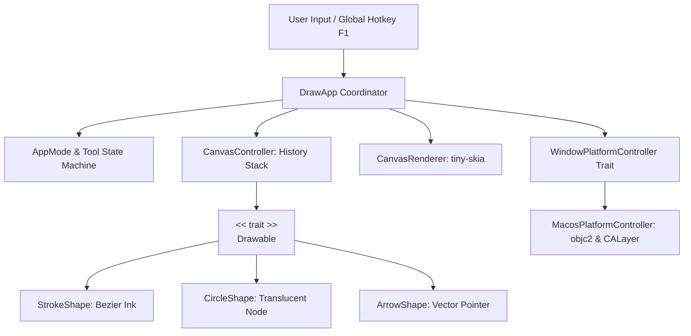

# 🖋️ draw-rs: macOS 全螢幕透明演算法解題塗鴉板

<div align="center">

<p>
  <a href="./README.md">English</a> | <b>繁體中文</b>
</p>

[](https://www.rust-lang.org/)
[](https://apple.com/)
[](https://en.wikipedia.org/wiki/SOLID)
[](LICENSE)

**專為 macOS 使用者打造的高效能透明螢幕塗鴉工具**  
專門輔助在 **LeetCode 刷題**、**系統架構設計**、**白板編程面試** 與 **線上教學演練** 時即時繪製資料結構！

<br />

[實機展示](#-實機展示-demo-preview) •
[功能亮點](#-核心功能特點) •
[快捷鍵操作](#-快捷鍵與操作指南) •
[架構設計 (SOLID)](#-solid-軟體架構) •
[快速啟動](#-快速啟動) •
[macOS 權限設定](#-macos-系統權限配置指南)

</div>

---

## 📸 實機展示 (Demo Preview)

<div align="center">
  
  <p><em>即時在 LeetCode 題目與編輯器上方進行透明向量標記與資料結構解說</em></p>
</div>

---

## 💡 為什麼需要 draw-rs？

在 LeetCode 或線上評測解題時，傳統的演算法草稿紙或外部繪圖軟體（如 Excalidraw）需要頻繁切換視窗，打斷思考。

`draw-rs` 直接在您的 macOS 螢幕上方懸浮一個 **100% 原生透明的向量畫布**：
- 🌲 **直接在 LeetCode 題目上方畫樹狀圖**（二元樹 Binary Tree、平衡樹 AVL）。
- 🔀 **標記雙指針 (Two Pointers) 與滑動窗口 (Sliding Window)** 範圍。
- 🔗 **標記鏈結串列指標 (`curr -> next`) 與有向圖路徑**。
- ⚡ **一鍵切換穿透模式**：畫完指標結構後，按下 <kbd>F1</kbd> 滑鼠直接穿透視窗，無縫在下方 VS Code / 瀏覽器敲代碼，塗鴉內容依然懸浮指引！

---

## 🌟 核心功能特點

| 功能模組 | 技術實現與特色 |
| :--- | :--- |
| **原生透明無邊框** | 基於 macOS `NSWindow` 與 `CALayer`，背景 Alpha = 0，無任何黑邊或延遲。 |
| **滑鼠穿透切換** | 透過現代型別安全庫 `objc2-app-kit` 調用 `setIgnoresMouseEvents:`，背景執行緒全域監聽 <kbd>F1</kbd>。 |
| **互動式選單 HUD 面板** | 全新浮動面板設計，提供可直接以滑鼠點擊選取的工具按鈕、色盤色票、Undo/Clear 與穿透切換鍵，支援全域拖曳。 |
| **滑鼠穿透模式可拖移與點選** | 實時座標碰撞檢測，在滑鼠穿透模式下將游標移至提示窗上方時動態解除穿透，可直接按住拖移面板或點擊選單，移出後自動恢復背景穿透。 |
| **演算法工具與智慧橡皮擦** | 自由畫筆 (<kbd>P</kbd>)、節點圓形 (<kbd>Circle</kbd>)、指向箭頭 (<kbd>Arrow</kbd>) 與向量橡皮擦 (<kbd>E</kbd>)，支援即時擦除圈與可逆復原 (Undo)。 |
| **演算法對比色盤** | 預設精選高對比高辨識色彩（天藍、翠綠、珊瑚紅、琥珀金、紫羅蘭），適合深淺主題。 |
| **極致輕量與效能** | 純 CPU 2D 向量光柵化 (`tiny-skia`)，記憶體佔用極低，編譯單一二進位檔案僅約 1.4 MB。 |

---

## ⌨️ 快捷鍵與操作指南

```
┌─────────────────────────────────────────────────────────────────────────────────┐
│ ● 繪圖模式 (3 個圖形)             [切換穿透 F1]                      ::: 拖移  │
│ ─────────────────────────────────────────────────────────────────────────────── │
│ 工具: [畫筆 P] [節點] [箭頭] [橡皮擦 E]           [復原 Z]  [清除 C]            │
│ ─────────────────────────────────────────────────────────────────────────────── │
│ 顏色: (●) (●) (●) (●) (●)   [1-5]                                 [繁體中文 ▼] │
└─────────────────────────────────────────────────────────────────────────────────┘
```

| 快捷鍵 / 滑鼠 | 動作 | 說明 |
| :---: | :--- | :--- |
| **點擊 HUD 選單按鈕** | **選取工具 / 顏色 / 動作** | 直接在浮動提示窗上點擊切換畫筆、形狀、橡皮擦、純色色票、復原、清空或穿透模式 |
| **語言下拉選單** | **切換界面語系 (i18n)** | 點擊 HUD 上的 `繁體中文 ▼` 或 `English ▼` 展開下拉式選單切換語言（語系定義於 `locales/*.yaml`） |
| **拖曳提示窗** | **移動 HUD 面板** | 按住提示窗面板頂部或背景並拖曳可移至螢幕任意位置（**繪圖模式**與**滑鼠穿透模式**皆可直接拖移！） |
| <kbd>F1</kbd> | **模式切換 (全域)** | 於「繪圖模式」與「滑鼠穿透模式」之間切換（無焦點時依然生效） |
| <kbd>F2</kbd> | **工具循環切換** | 循序循環：`畫筆 (Pen)` ➔ `節點 (Circle)` ➔ `箭頭 (Arrow)` ➔ `橡皮擦 (Eraser)` |
| <kbd>E</kbd> | **橡皮擦 (Eraser)** | 快速切換至橡皮擦工具，顯示圓形擦除游標，滑鼠拖曳接觸即擦除圖形 |
| <kbd>P</kbd> | **畫筆 (Pen)** | 快速切換回自由畫筆工具 |
| <kbd>1</kbd> ~ <kbd>5</kbd> | **切換色盤顏色** | 純圓形色票：天藍 (Cyan)、翠綠 (Emerald)、珊瑚紅 (Coral)、琥珀金 (Amber)、紫羅蘭 (Violet) |
| <kbd>L</kbd> | **切換語言快捷鍵** | 鍵盤快速循環切換語系（**繁體中文** / **English**） |
| <kbd>Z</kbd> | **復原 (Undo)** | 復原上一個繪製圖形，或將被橡皮擦擦除的圖形原位復原 |
| <kbd>C</kbd> | **清除 (Clear)** | 一鍵清空螢幕上所有筆記與圖形 |
| <kbd>Esc</kbd> | **關閉選單 / 離開程式** | 關閉開啟中的下拉選單，若無開啟選單則退出程式 |

---

## 🏗️ SOLID 軟體架構

本專案嚴格貫徹物件導向 SOLID 原則與 Idiomatic Rust 設計模式：



### 模組目錄職責劃分

```text
src/
├── app/                  # Application 控制器與狀態機
│   ├── mod.rs            # DrawApp (實作 winit 0.30 ApplicationHandler)
│   └── state.rs          # AppMode、DrawingTool、DragState、PaletteColor
├── controller/           # 高階畫布歷程管理器
│   ├── mod.rs
│   └── canvas.rs         # CanvasController (Vec<Box<dyn Drawable>> 復原/清除佇列)
├── models/               # 幾何數學與數據結構 (SRP, OCP, LSP)
│   ├── mod.rs            # 核心 Drawable Trait 定義
│   ├── point.rs          # Point2D 向量計算 (距離、角度、中點、插值)
│   ├── stroke.rs         # Pen 自由筆畫 (二階貝茲 Bézier 平滑曲線光柵化)
│   ├── circle.rs         # Circle 節點 (半透明填色 + 銳利外框)
│   └── arrow.rs          # Arrow 箭頭 (動態角度與三角形箭頭光柵化)
├── platform/             # 平台抽象與 macOS AppKit 封裝 (DIP & ISP)
│   ├── mod.rs            # WindowPlatformController Trait & PlatformError
│   └── macos.rs          # MacosPlatformController (完全封裝 unsafe 指針操作)
├── render/               # 向量光柵化緩衝區與 UI 繪製 (SRP)
│   ├── mod.rs
│   ├── font.rs           # 零相依 8x8 ASCII 點陣字體引擊
│   ├── hud.rs            # 毛玻璃狀態面板 HUD 繪製
│   └── renderer.rs       # tiny-skia Pixmap 記憶體管理
├── lib.rs                # 函式庫公開介面
└── main.rs               # 主程式入口與全域熱鍵監聽背景執行緒
```

### SOLID 具體實踐

1. **單一職責原則 (Single Responsibility Principle, SRP)**:
   - `models`：僅定義純幾何數學結構，不接觸視窗與事件。
   - `render`：僅負責將向量幾何數據光柵化至像素記憶體。
   - `platform`：專注於原生 macOS AppKit 與 CALayer 圖層配置。
   - `controller`：僅負責歷史紀錄堆疊管理與組合。
2. **開放封閉原則 (Open/Closed Principle, OCP) 與里氏替換原則 (LSP)**:
   - 核心定義抽象 Trait：
     ```rust
     pub trait Drawable: Send + Sync {
         fn draw(&self, pixmap: &mut tiny_skia::Pixmap);
     }
     ```
   - 擴充新圖形（例如網格 Grid、文字框 Text）只需新增 struct 並實作 `Drawable`，無須更動現有繪圖邏輯與歷程控制器。
   - 歷程容器統一管理 `Vec<Box<dyn Drawable>>`。
3. **介面隔離原則 (Interface Segregation Principle, ISP)**:
   - 平台視窗控制 (`WindowPlatformController`) 與畫布繪製職責徹底隔離，無肥大介面。
4. **依賴反轉原則 (Dependency Inversion Principle, DIP)**:
   - 高階畫布管理器僅依賴 `dyn Drawable` 抽象介面。
   - 應用程式依賴 `WindowPlatformController` 介面，將所有 unsafe Objective-C 指針呼叫完全限制在 `platform::macos` 模組內部。

---

## 🚀 安裝與快速啟動

### 安裝方式

#### 方式一：透過 Cargo 一鍵安裝（推薦）

直接從 GitHub 安裝二進位執行檔至系統的 `~/.cargo/bin`：

```bash
cargo install --git https://github.com/adrian-lin-1-0-0/draw-rs.git
```

安裝完成後，在任何終端機視窗輸入指令即可立刻啟動：
```bash
draw-rs
```

#### 方式二：從原始碼編譯執行

```bash
# 1. 複製專案
git clone https://github.com/adrian-lin-1-0-0/draw-rs.git
cd draw-rs

# 2. 執行單元與光柵化整合測試
cargo test

# 3. 編譯並執行生產最佳化版本
cargo run --release
```

產生的獨立可執行二進位檔位於：
```bash
./target/release/draw-rs
```

---

## ⚡ 全域快捷鍵與快速啟動設定指南

### 1. MacBook 頂部功能鍵 (<kbd>F1</kbd> / <kbd>fn</kbd> + <kbd>F1</kbd>) 設定

在 Apple 鍵盤或 MacBook 內建鍵盤上，最上排按鍵預設為硬體多媒體控制（螢幕亮度、音量、指揮中心）：
- **預設按法**：請按下 <kbd>fn</kbd> + <kbd>F1</kbd> 切換「繪圖模式」與「滑鼠穿透模式」。
- **設為標準功能鍵（推薦）**：
  1. 打開 macOS **系統設定 (System Settings)** ➔ **鍵盤 (Keyboard)** ➔ **鍵盤快速鍵 (Keyboard Shortcuts)** ➔ **功能鍵 (Function Keys)**。
  2. 開啟 **「將 F1、F2 等按鍵用作標準功能鍵」**。
  3. 設定後，即可直接單鍵按下 <kbd>F1</kbd> 切換模式，不需再長按 <kbd>fn</kbd> 鍵！

### 2. 設定全域快捷鍵一鍵喚起 `draw-rs`

推薦設定全域熱鍵（例如 <kbd>⌥</kbd> + <kbd>D</kbd> 或 <kbd>⌘</kbd> + <kbd>⇧</kbd> + <kbd>D</kbd>），讓你在刷 LeetCode 或寫程式時，隨時一鍵呼叫塗鴉板：

#### 推薦方式 A：使用 Raycast / Alfred（工程師最推薦）
- **Raycast**：
  1. 打開 **Raycast Settings** ➔ **Extensions** ➔ **Script Commands**。
  2. 新增一個指向 `~/.cargo/bin/draw-rs` 的腳本或 Quicklink。
  3. 為其指派熱鍵（例如 <kbd>⌥</kbd> + <kbd>D</kbd>）。
- **Alfred**：
  1. 打開 **Alfred Preferences** ➔ **Workflows** ➔ 新增空白 Workflow。
  2. 建立 **Hotkey** 觸發器 ➔ 連接至 **Run Script** (`~/.cargo/bin/draw-rs`)。

#### 推薦方式 B：macOS 原生「捷徑」App (Shortcuts)
1. 打開 macOS 內建的 **捷徑 (Shortcuts)** App，點擊 `+` 新增捷徑。
2. 加入動作：**執行 Shell 工序指令 (Run Shell Script)**。
3. 填入指令：
   ```bash
   ~/.cargo/bin/draw-rs &
   ```
4. 點擊右側面板的「捷徑詳細資訊」，勾選 **「用作快速動作」**，並點擊 **「加入鍵盤快速鍵」**（例如 <kbd>⌘</kbd> + <kbd>⇧</kbd> + <kbd>D</kbd>）。

#### 推薦方式 C：`skhd`（平鋪式視窗管理器使用者）
在 `~/.config/skhd/skhdrc` 加入以下設定：
```text
cmd + shift - d : ~/.cargo/bin/draw-rs
```

---

## 🛡️ macOS 系統權限配置指南

### 1. 為什麼背景能真正 100% 透明穿透？
- **透明度合成機制**：`draw-rs` 採用原生視窗透明屬性（Native Alpha = 0），透過 `objc2-app-kit`、`objc2-core-graphics` 與 `objc2-quartz-core` 直接將 `tiny-skia` 預乘 Alpha 像素緩衝區 (`PremultipliedLast`) 交付 macOS 系統級 **Quartz Compositor** 合成。
- **免除黑背景問題**：徹底解決了傳統 cross-platform buffer 函式庫因強制使用 `NoneSkipFirst` 而產生的全黑畫面瑕疵。
- **純浮動不偷取隱私**：`draw-rs` 是純粹懸浮於所有視窗上方的畫布，**完全不需要、也不會抓取您的螢幕畫面**。

---

### 2. 系統權限檢查與配置步驟

在 macOS（尤其是 macOS 14 Sonoma 與 macOS 15 Sequoia）上，全域快捷鍵與視窗穿透需要對應的安全權限：

#### A. 輔助使用權限 (Accessibility) —— 【必備】
當切換為「滑鼠穿透模式」後，滑鼠會點擊下方的 VS Code 或瀏覽器，此時 `draw-rs` 視窗會處於無焦點狀態。為了讓背景執行緒能夠攔截全域 <kbd>F1</kbd> 按鍵切回繪圖模式：
1. 打開 **系統設定 (System Settings)** ➔ **隱私權與安全性 (Privacy & Security)**。
2. 點選 **輔助使用 (Accessibility)**。
3. 點擊 `+` 按鈕，加入您使用的終端機（如 **Terminal / 終端機**、**iTerm**、**Ghostty**、**VS Code**）或編譯出的 `draw-rs` 執行檔，並確認開關為 **開啟 (ON)**。
4. *終端機快捷指令*：
   ```bash
   open "x-apple.systempreferences:com.apple.preference.security?Privacy_Accessibility"
   ```

#### B. 輸入監控權限 (Input Monitoring) —— 【選用】
若您的 macOS 有開啟深度安全策略，全域鍵盤監聽可能需要授權：
```bash
open "x-apple.systempreferences:com.apple.preference.security?Privacy_ListenEvent"
```

#### C. 螢幕錄製權限 (Screen Recording) —— 【選用】
若您在 LeetCode 刷題時希望搭配 **OBS**、**Zoom 螢幕分享** 或 **系統截圖快捷鍵 (Cmd+Shift+4)** 將螢幕筆記連同底層題目一同錄製，請確保該**第三方錄影/截圖軟體**具備螢幕錄製授權：
```bash
open "x-apple.systempreferences:com.apple.preference.security?Privacy_ScreenCapture"
```

---

## 📄 開源授權 (License)

本專案採用 [MIT License](LICENSE) 授權條款開源發布。
