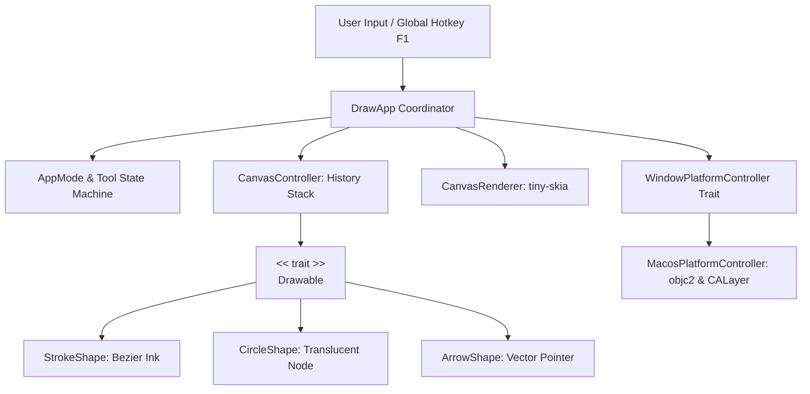

# 🖋️ draw-rs: macOS 全螢幕透明演算法解題塗鴉板

<div align="center">

<p>
  <a href="./README.md">English</a> | <b>繁體中文</b>
</p>

[](https://www.rust-lang.org/)
[](https://apple.com/)
[](https://en.wikipedia.org/wiki/SOLID)
[](LICENSE)

**專為 macOS 使用者打造的高效能透明螢幕塗鴉工具**  
專門輔助在 **LeetCode 刷題**、**系統架構設計**、**白板編程面試** 與 **線上教學演練** 時即時繪製資料結構！

[功能亮點](#-核心功能特點) •
[快捷鍵操作](#-快捷鍵與操作指南) •
[架構設計 (SOLID)](#-solid-軟體架構) •
[快速啟動](#-快速啟動) •
[macOS 權限設定](#-macos-系統權限配置指南)

</div>

---

## 💡 為什麼需要 draw-rs？

在 LeetCode 或線上評測解題時，傳統的演算法草稿紙或外部繪圖軟體（如 Excalidraw）需要頻繁切換視窗，打斷思考。

`draw-rs` 直接在您的 macOS 螢幕上方懸浮一個 **100% 原生透明的向量畫布**：
- 🌲 **直接在 LeetCode 題目上方畫樹狀圖**（二元樹 Binary Tree、平衡樹 AVL）。
- 🔀 **標記雙指針 (Two Pointers) 與滑動窗口 (Sliding Window)** 範圍。
- 🔗 **標記鏈結串列指標 (`curr -> next`) 與有向圖路徑**。
- ⚡ **一鍵切換穿透模式**：畫完指標結構後，按下 <kbd>F1</kbd> 滑鼠直接穿透視窗，無縫在下方 VS Code / 瀏覽器敲代碼，塗鴉內容依然懸浮指引！

---

## 🌟 核心功能特點

| 功能模組 | 技術實現與特色 |
| :--- | :--- |
| **原生透明無邊框** | 基於 macOS `NSWindow` 與 `CALayer`，背景 Alpha = 0，無任何黑邊或延遲。 |
| **滑鼠穿透切換** | 透過現代型別安全庫 `objc2-app-kit` 調用 `setIgnoresMouseEvents:`，背景執行緒全域監聽 <kbd>F1</kbd>。 |
| **LeetCode 專用工具** | 自由畫筆 (<kbd>Pen</kbd>)、節點圓形 (<kbd>Circle</kbd>)、指向箭頭 (<kbd>Arrow</kbd>)，拖曳即時預覽。 |
| **演算法對比色盤** | 預設精選高對比高辨識色彩（天藍、翠綠、珊瑚紅、琥珀金、紫羅蘭），適合深淺主題。 |
| **毛玻璃 HUD 面板** | 左上角半透明懸浮面板，內建零相依 8x8 ASCII 向量點陣字體，即時顯示工具與狀態。 |
| **極致輕量與效能** | 純 CPU 2D 向量光柵化 (`tiny-skia`)，記憶體佔用極低，編譯單一二進位檔案僅約 1.4 MB。 |

---

## ⌨️ 快捷鍵與操作指南

```
┌────────────────────────────────────────────────────────────────────────┐
│ ● DRAWING  |  TOOL: Pen  |  SHAPES: 3                                   │
│ [F1] Pass-thru  [F2] Tool  [1-5] Color: Cyan  [Z] Undo  [C] Clear       │
└────────────────────────────────────────────────────────────────────────┘
```

| 快捷鍵 | 動作 | 說明 |
| :---: | :--- | :--- |
| <kbd>F1</kbd> | **模式切換 (全域)** | 於「繪圖模式」與「滑鼠穿透模式」之間切換（無焦點時依然生效） |
| <kbd>F2</kbd> | **工具循環切換** | `Pen (自由手繪)` ➔ `Circle (樹/圖節點)` ➔ `Arrow (指針/邊)` |
| <kbd>1</kbd> ~ <kbd>5</kbd> | **切換色盤顏色** | `1: 天藍 (Cyan)`、`2: 翠綠 (Emerald)`、`3: 珊瑚紅 (Coral)`、`4: 琥珀金 (Amber)`、`5: 紫羅蘭 (Violet)` |
| <kbd>Z</kbd> | **復原 (Undo)** | 移除最近一次繪製的圖形 |
| <kbd>C</kbd> | **清除 (Clear)** | 一鍵清空螢幕上所有筆記與圖形 |
| <kbd>Esc</kbd> | **離開程式** | 關閉並安全退出 |

---

## 🏗️ SOLID 軟體架構

本專案嚴格貫徹物件導向 SOLID 原則與 Idiomatic Rust 設計模式：



### 模組目錄職責劃分

```text
src/
├── app/                  # Application 控制器與狀態機
│   ├── mod.rs            # DrawApp (實作 winit 0.30 ApplicationHandler)
│   └── state.rs          # AppMode、DrawingTool、DragState、PaletteColor
├── controller/           # 高階畫布歷程管理器
│   ├── mod.rs
│   └── canvas.rs         # CanvasController (Vec<Box<dyn Drawable>> 復原/清除佇列)
├── models/               # 幾何數學與數據結構 (SRP, OCP, LSP)
│   ├── mod.rs            # 核心 Drawable Trait 定義
│   ├── point.rs          # Point2D 向量計算 (距離、角度、中點、插值)
│   ├── stroke.rs         # Pen 自由筆畫 (二階貝茲 Bézier 平滑曲線光柵化)
│   ├── circle.rs         # Circle 節點 (半透明填色 + 銳利外框)
│   └── arrow.rs          # Arrow 箭頭 (動態角度與三角形箭頭光柵化)
├── platform/             # 平台抽象與 macOS AppKit 封裝 (DIP & ISP)
│   ├── mod.rs            # WindowPlatformController Trait & PlatformError
│   └── macos.rs          # MacosPlatformController (完全封裝 unsafe 指針操作)
├── render/               # 向量光柵化緩衝區與 UI 繪製 (SRP)
│   ├── mod.rs
│   ├── font.rs           # 零相依 8x8 ASCII 點陣字體引擊
│   ├── hud.rs            # 毛玻璃狀態面板 HUD 繪製
│   └── renderer.rs       # tiny-skia Pixmap 記憶體管理
├── lib.rs                # 函式庫公開介面
└── main.rs               # 主程式入口與全域熱鍵監聽背景執行緒
```

### SOLID 具體實踐

1. **單一職責原則 (Single Responsibility Principle, SRP)**:
   - `models`：僅定義純幾何數學結構，不接觸視窗與事件。
   - `render`：僅負責將向量幾何數據光柵化至像素記憶體。
   - `platform`：專注於原生 macOS AppKit 與 CALayer 圖層配置。
   - `controller`：僅負責歷史紀錄堆疊管理與組合。
2. **開放封閉原則 (Open/Closed Principle, OCP) 與里氏替換原則 (LSP)**:
   - 核心定義抽象 Trait：
     ```rust
     pub trait Drawable: Send + Sync {
         fn draw(&self, pixmap: &mut tiny_skia::Pixmap);
     }
     ```
   - 擴充新圖形（例如網格 Grid、文字框 Text）只需新增 struct 並實作 `Drawable`，無須更動現有繪圖邏輯與歷程控制器。
   - 歷程容器統一管理 `Vec<Box<dyn Drawable>>`。
3. **介面隔離原則 (Interface Segregation Principle, ISP)**:
   - 平台視窗控制 (`WindowPlatformController`) 與畫布繪製職責徹底隔離，無肥大介面。
4. **依賴反轉原則 (Dependency Inversion Principle, DIP)**:
   - 高階畫布管理器僅依賴 `dyn Drawable` 抽象介面。
   - 應用程式依賴 `WindowPlatformController` 介面，將所有 unsafe Objective-C 指針呼叫完全限制在 `platform::macos` 模組內部。

---

## 🚀 快速啟動

### 系統需求
- **作業系統**：macOS 13.0+ (Ventura, Sonoma, Sequoia)
- **架構**：Apple Silicon (M1/M2/M3/M4) 或 Intel (x86_64)
- **編譯環境**：Rust 1.85+ (Edition 2024)

### 編譯與執行

```bash
# 1. 複製專案
git clone https://github.com/adrian-lin-1-0-0/draw-rs.git
cd draw-rs

# 2. 執行單元與光柵化整合測試
cargo test

# 3. 編譯並執行生產最佳化版本
cargo run --release
```

產生的獨立可執行二進位檔位於：
```bash
./target/release/draw-rs
```

---

## 🛡️ macOS 系統權限配置指南

### 1. 為什麼背景能真正 100% 透明穿透？
- **透明度合成機制**：`draw-rs` 採用原生視窗透明屬性（Native Alpha = 0），透過 `objc2-app-kit`、`objc2-core-graphics` 與 `objc2-quartz-core` 直接將 `tiny-skia` 預乘 Alpha 像素緩衝區 (`PremultipliedLast`) 交付 macOS 系統級 **Quartz Compositor** 合成。
- **免除黑背景問題**：徹底解決了傳統 cross-platform buffer 函式庫因強制使用 `NoneSkipFirst` 而產生的全黑畫面瑕疵。
- **純浮動不偷取隱私**：`draw-rs` 是純粹懸浮於所有視窗上方的畫布，**完全不需要、也不會抓取您的螢幕畫面**。

---

### 2. 系統權限檢查與配置步驟

在 macOS（尤其是 macOS 14 Sonoma 與 macOS 15 Sequoia）上，全域快捷鍵與視窗穿透需要對應的安全權限：

#### A. 輔助使用權限 (Accessibility) —— 【必備】
當切換為「滑鼠穿透模式」後，滑鼠會點擊下方的 VS Code 或瀏覽器，此時 `draw-rs` 視窗會處於無焦點狀態。為了讓背景執行緒能夠攔截全域 <kbd>F1</kbd> 按鍵切回繪圖模式：
1. 打開 **系統設定 (System Settings)** ➔ **隱私權與安全性 (Privacy & Security)**。
2. 點選 **輔助使用 (Accessibility)**。
3. 點擊 `+` 按鈕，加入您使用的終端機（如 **Terminal / 終端機**、**iTerm**、**Ghostty**、**VS Code**）或編譯出的 `draw-rs` 執行檔，並確認開關為 **開啟 (ON)**。
4. *終端機快捷指令*：
   ```bash
   open "x-apple.systempreferences:com.apple.preference.security?Privacy_Accessibility"
   ```

#### B. 輸入監控權限 (Input Monitoring) —— 【選用】
若您的 macOS 有開啟深度安全策略，全域鍵盤監聽可能需要授權：
```bash
open "x-apple.systempreferences:com.apple.preference.security?Privacy_ListenEvent"
```

#### C. 螢幕錄製權限 (Screen Recording) —— 【選用】
若您在 LeetCode 刷題時希望搭配 **OBS**、**Zoom 螢幕分享** 或 **系統截圖快捷鍵 (Cmd+Shift+4)** 將螢幕筆記連同底層題目一同錄製，請確保該**第三方錄影/截圖軟體**具備螢幕錄製授權：
```bash
open "x-apple.systempreferences:com.apple.preference.security?Privacy_ScreenCapture"
```

---

## 📄 開源授權 (License)

本專案採用 [MIT License](LICENSE) 授權條款開源發布。
